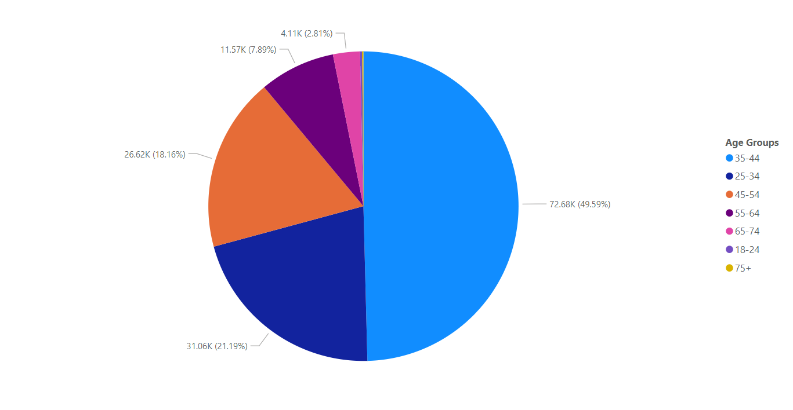
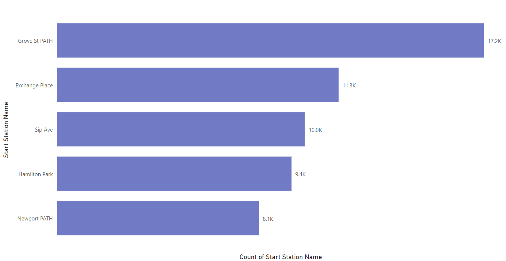
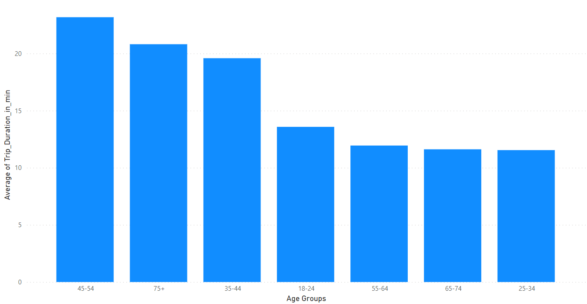
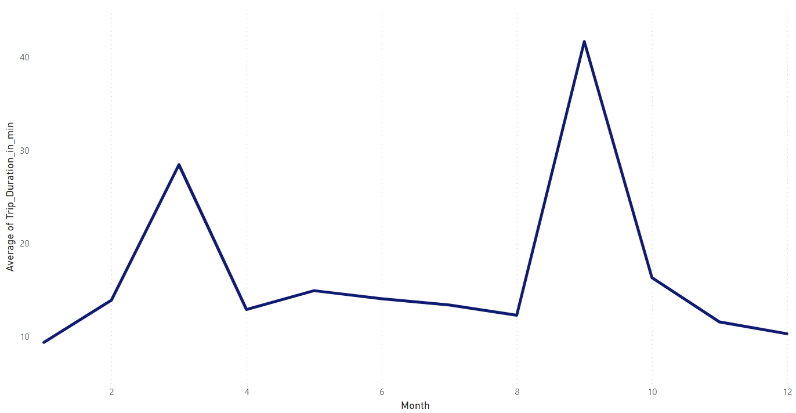
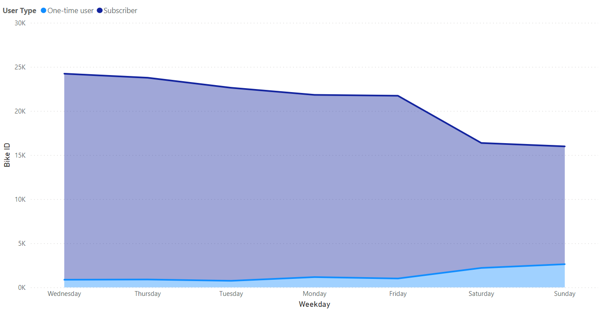

# The New York City Bikes Data Set 
### Trinh Dinh Tuan
### Data Analyst Portfolio 2022
### Tools used in this project
- Python
- Power BI
- Power Point
---
## Table of contents
1. [Introduction](#introduction)

2. [Data Cleaning](#section2)

3. [Descriptive Statistics and Exploratory Data Analysis](#section3)
    1. [Descriptive statistics for “Trip duration” and “User age”](#sec3p1)
    2. [Top pick-up locations](#sec3p2)
    3. [Average of Trip Duration among age groups and months](#sec3p3)
    4. [Number of users by age group](#sec3p4)
    5. [One-time users vs long-term subscribers on different days of the week](#sec3p5)
    
4. [Data Visualization](#section4)
    1. [Which age group rents the most bikes?](#sec4p1)
    2. [Top 5 pick up location](#sec4p2)
    3. [Average trip duration varies across different age groups and over time](#sec4p3)
    4. [Stacked stepped area chart for weekday and user type](#sec4p4)
    5. [Scatter plots for age and weather vs trip duration](#sec4p5)  
        
5. [Conclusion](#conclusion)
---
## 1. Introduction 
- This README describes work done on The New York Citi Bikes Data Set. Resources used include Python with associated packages Pandas to clean the data. Then the author uses Power BI for visualization. Lastly, I use Power Point to tell a story with data from The New York Citi Bikes Data Set.
- Citi Bike is the largest bike-share program in the United States, with 20,000 bikes and over 1,300 pick-up stations across Manhattan, Brooklyn, Queens, the Bronx, and Jersey City. As stated on their website, the service was designed for quick trips with convenience in mind, offering a fun and affordable way to get around town. Users can sign up for annual membership, or buy a short-term pass through the Citi Bike app.
- My mission is to analyze data collected by Citi Bike and help key stakeholders to make smart, data-driven decisions based on the insights you uncover. Here’s what I’ll seek to investigate:
    **1. What are the most popular pick-up locations across the city for Citi Bike rental?
    2. How does the average trip duration vary across different age groups, and over time?
    3. Which age group rents the most bikes?
    4. How does bike rental vary across the two user groups (one-time users vs long-term subscribers) on different days of the week?
    5. Do factors like weather and user age impact the average bike trip duration?**

##  2. Data cleaning 
With the data from The New York Citi Bikes Data Set, I proceed to clean the data with python.

I’ll focus on:
1. Identifying and removing unnecessary column
2. Identifying and removing duplicates
3. Identifying and handling missing data points

##  3. Descriptive Statistics and Exploratory Data Analysis 
Exploratory Data Analysis refers to the critical process of performing initial investigations on data so as to discover patterns,to spot anomalies,to test hypothesis and to check assumptions with the help of summary statistics and graphical representations.

Descriptive statistics help you to summarize or describe the characteristics of your dataset in a meaningful way. Descriptive statistics are also useful for spotting potential errors or strange occurrences within your dataset.

Our analysis will consist of two parts:

1. Calculating some of the descriptive statistics we covered earlier on: the mean, median, minimum, and maximum values for two variables of interest (trip duration in minutes and user age).
2. Creating pivot tables to summarize our descriptive statistics.

### 3.1 Descriptive statistics for “Trip duration” and “User age” 
| Statistic | Trip duration | Age |
| --------- | ------------- | --- |
| Mean      | 13.5          | 41  |
| Median    | 6             | 39  |
| Min       | 1             | 21  |
| Max       | 35069         | 90  |

After conducting the analysis, I noticed that the maximum values for two variables, “Trip duration” and “User age,” are rather unrealistic. It’s highly unlikely that someone rode a Citi Bike for 337,670 minutes (that’s about 5,627 hours, or 234 days!) It’s also hard to believe that one of our Citi Bike users is 121 years old. Because there are a few values, I can remove these outliers from data.

Having calculated some descriptive statistics for our dataset, we are starting to see some initial insights about our Citi Bike users. Have a go at answering the following questions to paint a picture of the Citi Bike user base:
- What’s the average age of Citi Bike users?
- What’s the average trip duration for Citi Bike users?
- What were the shortest and longest trips taken by Citi Bike users?

### 3.2 Top pick-up locations 
After using the pivot table, we get the following top 20 pick-up locations for Citi Bike rentals in New York:
| Start station name | Count |
| ------------------ | -----:|
| Grove St PATH      | 17176 |
| Exchange Place     | 11328 |
| Sip Ave            | 9971  |
| Hamilton Park      | 9434  |
| Newport PATH       | 8127  |
| ...                | ...   |

### 3.3 Average of Trip Duration among age groups and months 
Next, we want to explore how the average trip duration varies across different age groups, and over time.

After using the pivot table, we get the following table:
| Age groups | Avg of Trip Duration |
| ---------- | --------------------:|
| 18-24      | 13.6                 |
| 25-34      | 11.5                 |
| 35-44      | 14.9                 |
| 45-54      | 13                   |
| 55-64      | 11.9                 |
| 65-74      | 11.6                 |
| 75+        | 21.3                 |

### 3.4 Number of users by age group 
In order to answer our third question - which age group rents the most bikes? We need to create another pivot table. This time, we’re looking at the number of unique bike rentals (calculated using the variable “Bike ID”) and summarizing the count by user age (using the “Age group” variable)

After using the pivot table, we get the following table:
| Age groups | Count |
| ---------- | -----:|
| 18-24      | 322   |
| 25-34      | 31055 |
| 35-44      | 72675 |
| 45-54      | 26619 |
| 55-64      | 11571 |
| 65-74      | 4114  |
| 75+        | 185   |

### 3.5. One-time users vs long-term subscribers on different days of the week 
At the start , I posed another interesting question: "How does bike rental vary across the two user groups (one-time users vs long-term subscribers) on different days of the week?"

Once again, we can answer this question by creating a pivot table:
| Weekday   | One-time user | Subscriber |
| --------- | ------------: | ---------: |
| Monday    |          1169 |      20656 |
| Tuesday   |           744 |      21888 |
| Wednesday |           872 |      23359 |
| Thursday  |           894 |      22870 |
| Friday    |          1012 |      20715 |
| Saturday  |          2202 |      14174 |
| Sunday    |          2634 |      13352 |

## 4. Data Visualization 
 Data visualization is all about presenting data in a visual format, such as a graph, chart, or map. This is useful as it helps to highlight the most important or relevant insights from a dataset, making it easier to spot patterns, trends, and relationships, as well as outliers (data points that differ significantly from other observations in dataset)

 In this project, I used Power BI for Data Visualization

### 4.1 Which age group rents the most bikes? 
To answer our third question, which age group rents the most bikes? We’ll create another pie chart, this time with the count of bikes rented per age group

### 4.2 Top 5 pick up location 
I will visualize top 5 pick up location:

### 4.3 Average of Trip Duration among age groups and months 
#### 4.3.1 Average of Trip duration among age groups
We already summarized the relevant data with a pivot table in previous part, so now we’re going to visualize it using a column chart: 

#### 4.3.2 Average of Trip duration over time
The second part of question two explores how the average trip duration varies over time. In this case, “over time” refers to the different months of the year. In general, time comparisons are best plotted over a line so that we can see the development chronologically. So, for this one, we’re going to create a line graph:

### 4.4 Stacked stepped area chart for weekday and user type 
Another question our Citi Bike stakeholders want to answer is: "How does bike usage vary across the two user groups (one-time users vs. long-term subscribers) on different days of the week?"

To create our pivot table, we counted all bike rentals per each day of the week, broken down by the variable “User type” where we distinguish between Citi Bike subscribers and one-time users. Since “User Type” is a categorical column, we can use a special type of chart in order to see these categories within the frequencies of “Bike ID”: the stacked stepped area chart.

### 4.5 Scatter plots for age and weather vs trip duration 
Now we’ll seek to answer the last remaining question: "Do factors like weather and user age impact the average bike trip duration?"

To do this, we’ll create two scatter plots, plotting trip duration vs age and then trip duration vs weather (measured by air temperature).

#### Scatter plots for age vs trip duration

What this plot shows us is that there’s a heavy overload of values in the lower ranges of “Trip duration,” which means that most trips are rather short, regardless of the user age. In other words, we’re not really seeing any hint of a correlation between user age and trip duration.

However, we can spot a few much longer trips (>5,000 mins) in the age bracket 30-55. Perhaps someone was visiting town for the weekend and wanted to have a bike at hand for the entire time. Expectedly, the trips the elderly took didn’t show any extremities in terms of length.

#### Scatter plots for weather vs trip duration

Here, we can see a couple of extreme values for trip duration (>10,000 mins) again. Apart from this, the scatter plot confirms what we would expect to see in terms of “popular” temperatures for bike rides. This finding is consistent with the line chart we created earlier: the longer bike trips seem to happen when the temperatures are around 20 degrees, which is usually in early summer and autumn for New York.

## 5. Conclusion 
>##### 1. What are the most popular locations across the city for Citi Bike rental? 
#### Grove St Path is the most popular pick-up station.

>##### 2. How does the average trip duration vary across different age groups, and over time?
#### The people who have age from 45 to 54 took the longest trips on average. 
#### On average, Citi Bike users took the longest trips in September and the shortest trips in January.

>##### 3. Which age group rents the most bikes?
#### 35-44 year olds rented the most bikes.

>##### 4. How does bike rental vary across the two user groups (one-time users vs long-term subscribers) on different days of the week?
#### Most Citi Bike users are long-term subscribers. In particular, long-term subcribers tend to use the service at the beginning of week while one-time users tend to use the service at the weekend.

>##### 5. Do factors like weather and user age impact the average bike trip duration?
#### From our first scatter plot, we saw that there doesn’t seem to be a notable correlation between the user’s age and how long they ride for. But, our second plot suggests a relationship between temperature and trip duration—we could surmise that, as the temperature increases (i.e. as the weather improves), people are likely to take longer trips on their Citi Bikes.
